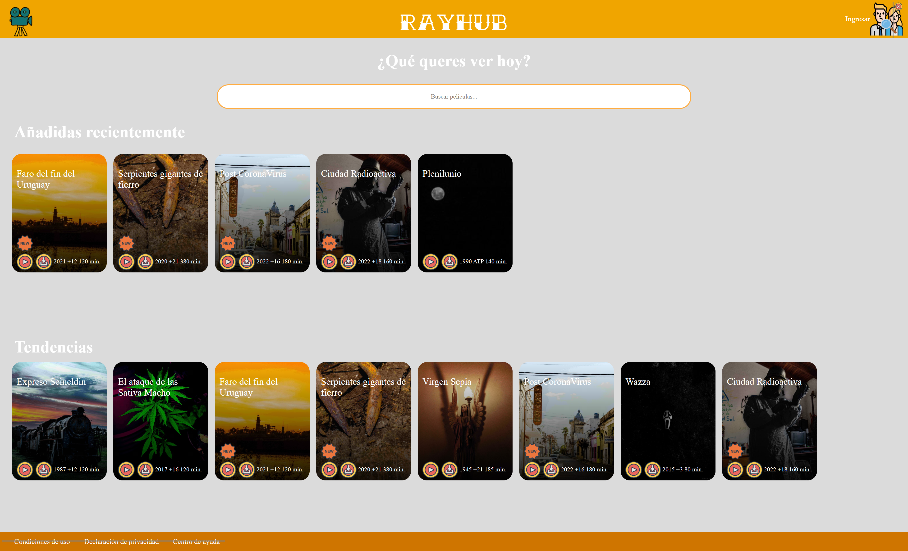
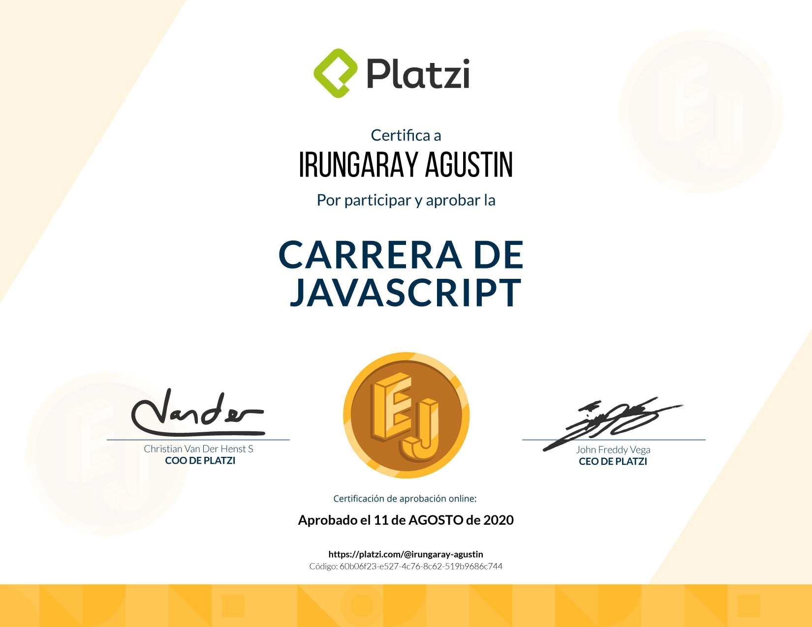

# RayHub

Full MERN Stack PWA

**Desarrollo en progreso!**

*Siendo este mi proyecto más completo y ambicioso, sumado a que aún está en desarrollo, es probable que encuentres algún bug, de ser así te invito a reportarlo!*

Para enterarte cuando sea desplegada la versión final, seguí el Repositorio!

## Links

Podés mirar el template de la versión final acá:
https://irungaray.github.io/RayHub/

Su API acá:
https://github.com/Irungaray/moviesAPI

Y en este Gist vas a encontrar el flujo de información más al detalle:
https://gist.github.com/Irungaray/a8169349806db225ad508973c1edefdc#file-gistfile1-txt

## Algunas de las features que ofrece son:

* App hecha en React
* Conexión a MongoDB
* Server-Side Rendering con Express
* Compilado con Node
* Patrón arquitectónico Backend for Frontend
* Registro de usuarios con Passport
* Actions y Reducers con Redux y Axios
* API dedicada a servir las películas
* Navegación entre páginas con React Router
* Configuración de desarrollo y producción con Webpack
* Tests de Jest personalizados para la App y la API
* Coverage con Jest y Mocha
* Transpilado con Babel
* Estandarización de código con ESLint
* Middlewares de Helmet
* Variables de entorno con DotEnv
* Assets minificados con Vendor
* Estilos con SASS creados desde 0 (No Bootstrap)
* Progressive Web App
* Add to Home Screen
* Control de versiones con Git CLI
* Template de versión final creado desde 0 en HTML y CSS con metodología BEM
* Transformado luego a componentes y containers de React para finalmente conectarse al Backend
* App a ser desplegada en Heroku, API en Vercel

* Todas las fotografías fueron tomadas por mí

## Scripts
*Antes que nada, crea las variables de entorno según el archivo .env.example de la API y de la App*

Luego, inicializar la API (Linkeada más arriba) con:

* `npm install` para instalar las dependencias
* `npm run dev` para inicializar en modo Desarrollo
* `npm start` para inicializar en modo Producción
* `npm run test` para correr los Tests de Mocha
* `npm run cover` para medir el Coverage de los test

Luego, inicilizar la aplicación con:

* `npm install` para instalar las dependencias
* `npm start` para inicializar ( indicar modo en dotenv )
* `npm run lint` para normalizar la sintaxis con ESLint
* `npm run test` para correr los tests de Jest
* `npm run test:coverage` para medir el Coverage de los test

## Licencia

MIT

*Proyecto de la Carrera de JavaScript de Platzi*

*+300 hs de JavaScript*
